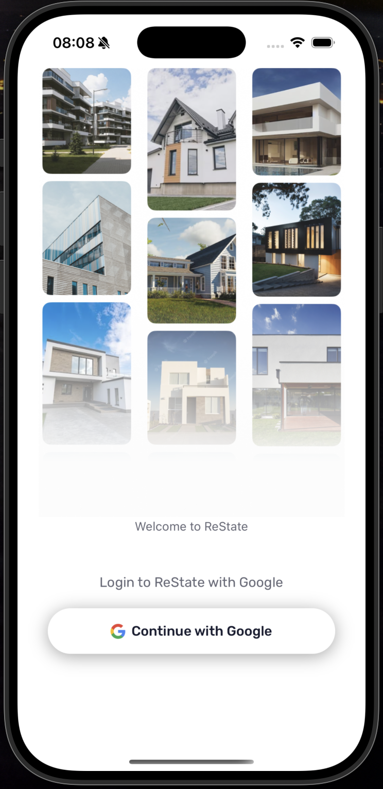
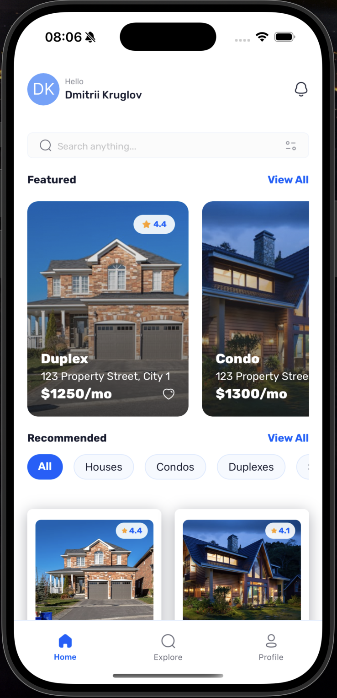
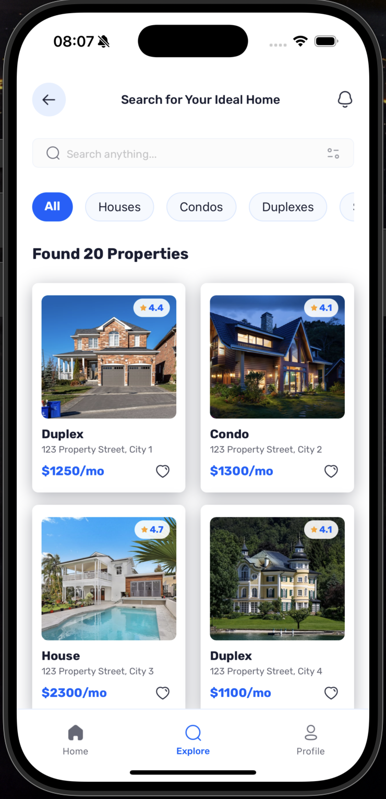
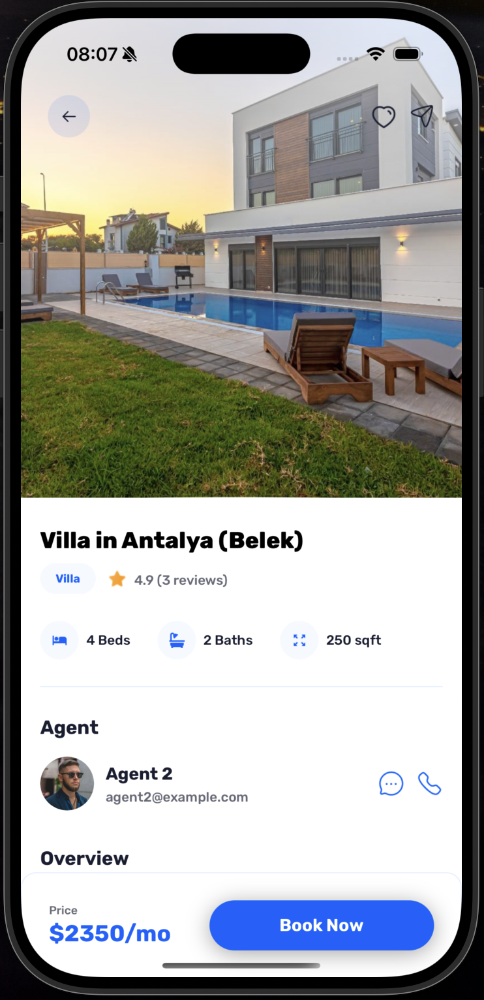
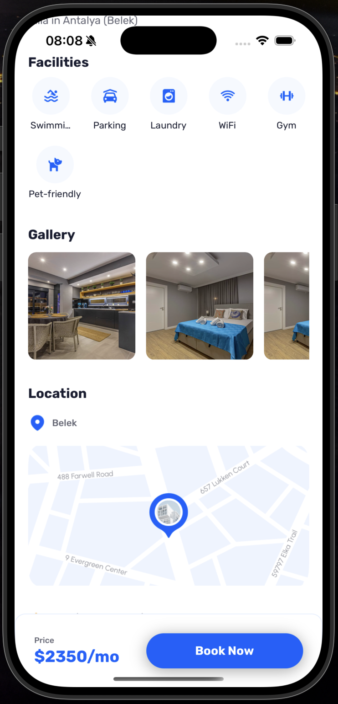

# A Real Estate App

This is an [Expo](https://expo.dev) project created with [`create-expo-app`](https://www.npmjs.com/package/create-expo-app).

### Introduction

A full-stack Real Estate application with React Native, featuring Google authentication, dynamic property listings, and user profiles. Designed with Expo SDK 52, Appwrite, Tailwind CSS, and TypeScript for a seamless and scalable experience.

### Tech Stack

- Expo
- React Native
- TypeScript
- Nativewind
- Appwrite
- Tailwind CSS

### Features

👉 **Authentication with Google**: Secure and seamless user sign-ins using Google’s authentication service.

👉 **Home Page**: Displays the latest and recommended properties with powerful search and filter functionality.

👉 **Explore Page**: Allows users to browse all types of properties with a clean and intuitive interface.

👉 **Property Details Page**: Provides comprehensive information about individual properties, including images and key details.

👉 **Profile Page**: Customizable user settings and profile management

👉 **Centralized Data Fetching**: Custom-built solution inspired by TanStack’s useQuery for efficient API calls.
